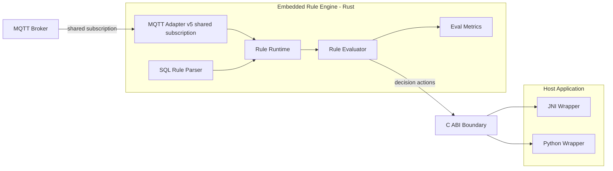

# BifroRE (Embedded MQTT Rule Engine)

BifroRE is now an embedded MQTT rule engine delivered as a Rust library with a C ABI.
It connects to an MQTT broker via shared subscriptions, evaluates SQL-like rules in memory,
and returns evaluation results to the host application via callbacks (JNI / Python / C).

## Architecture



## Key Differences (Old vs New)

- Old: standalone Java services (router/processor/admin). New: embedded Rust library with C ABI.
- Old: rule matching done in Java router. New: in-memory trie matcher in Rust.
- Old: SQL rules parsed by Trino + MVEL. New: SQL subset parser in Rust with MQTT-native extensions.
- Old: downstream delivery handled by built-in plugins. New: host application handles destinations.

## Rule DSL (SQL + MQTT extensions)

Examples:
- Topic filters and alias:
  - `select * from 'sensors/+/temp' as t`
- Topic level function:
  - `where topic_level(t, 2) = 'room1'`
- Metadata/properties:
  - `where qos >= 1 and properties['content-type'] = 'application/json'`

Supported (current):
- `SELECT *` or `SELECT expr [AS alias]`
- `FROM <topic filter>` with `+` and `#` wildcards
- `WHERE` with `AND/OR`, comparisons, arithmetic
- `topic_level(alias, index)` (1-based index)
- Metadata: `qos`, `retain`, `dup`, `timestamp`, `clientId`, `username`
- MQTT v5 properties via `properties['key']`

## Recent Features & Optimizations

- Global payload decode mode at engine init: `JSON` or `Protobuf`.
- Protobuf support for typed payloads (schema-based, `prost` generated messages).
- Compiled expression plan with constant folding at rule compile time.
- Fast predicate path for common comparisons and adaptive predicate reordering.
- Automatic fast-path downgrade when runtime miss ratio is persistently high.

## Build

Requirements:
- Rust (cargo)
- For JNI: JDK (JAVA_HOME set)

Build the artifacts:

```bash
./build.sh jni     # Rust cdylib + JNI bridge
./build.sh python  # Rust cdylib only (Python wrapper is pure ctypes)
./build.sh provision-cli # client-id provisioning CLI
./build.sh all     # both
./build.sh bench   # run runtime benchmarks
./build.sh bench-diff # compare serde_json vs simd-json and json vs protobuf
```

Optional feature flags (manual cargo usage):

```bash
# core with SIMD JSON parser
cargo build -p bifrore-embed-core --features simd-json

# ffi with mqtt + SIMD JSON parser
cargo build -p bifrore-embed-ffi --features "mqtt simd-json"
```

Note: `simd-json` is workload and platform dependent; it is not guaranteed to be faster than
`serde_json` in every case.

Artifacts are placed under `build/`:
- `libbifrore_embed.(so|dylib)`
- `libbifrore_jni.(so|dylib)` (JNI)
- `bifrore-clientid-provision` (client-id provisioning CLI)

## Client ID Provisioning

MQTT persistent sessions are stateful on the broker side. In BifroRE, the client-id file is the
source of truth for those sessions.

Runtime behavior:
- If the client-id file exists, BifroRE loads and uses those IDs as-is.
- If the file does not exist, BifroRE generates plain defaults: `nodeId_index`.
- If the client-id file count does not match the requested `client_count`, BifroRE aligns to the
  file count instead of the requested count.

This is intentional: persistent MQTT sessions are mapped to client IDs, so session continuity is
more important than treating `client_count` as a stateless scaling knob.

If you need broker-specific client-id placement, provision the file before starting BifroRE. The
runtime itself stays decoupled from broker bucket logic and remains broker-neutral.

Build the provisioning CLI:

```bash
./build.sh provision-cli
```

Run it:

```bash
./build/bifrore-clientid-provision <user_id> <node_id> <client_count> <output_path>
```

The provisioning CLI implements the current reverse-hash strategy as a co-design for BifroMQ,
whose bucket is:

```java
private static byte bucket(String inboxId) {
    int hash = inboxId.hashCode();
    return (byte) ((hash ^ (hash >>> 16)) & 0xFF);
}
```

with:

```text
inboxId = userId + "/" + clientId
```

The generated client IDs are written to the target file and can then be consumed by BifroRE at
startup.

This CLI is not a generic requirement for all MQTT brokers. Other brokers may not care about
client-id patterns at all, or may require a different pattern. BifroRE runtime behavior remains
clear and neutral:
- load client IDs from file if present
- otherwise generate plain `nodeId_index` defaults
- treat the client-id file as authoritative for persistent-session continuity

If your broker needs a different provisioning policy, generate the client-id file with your own
tooling and let BifroRE consume it unchanged.

## JNI Usage (Java)

```java
BifroRE re = new BifroRE("127.0.0.1", 1883);
re.onMessage((ruleId, payload, destinationsJson) -> {
    // handle evaluated payload + destinations
});
re.loadRules("/path/to/rule.json");
re.start();
```

## Python Usage

```python
from bindings.python.bifrore import BifroRE

engine = BifroRE("./build/libbifrore_embed.dylib")
engine.on_message(lambda rule_id, payload, destinations: print(rule_id, destinations))
engine.load_rules("./rule.json")
engine.start_mqtt("127.0.0.1", 1883, "client-1", "bifrore-group")
```

## Typed Protobuf Decoder (Rust Embed)

For high-performance protobuf decoding, use typed messages (generated by `prost`) and provide a
typed decoder to the engine:

```rust
use bifrore_embed_core::payload::typed_protobuf_decoder;
use bifrore_embed_core::runtime::RuleEngine;

let decoder = typed_protobuf_decoder::<MyMessage, _>(|msg| {
    let mut out = serde_json::Map::new();
    out.insert("temp".into(), serde_json::Value::from(msg.temp));
    out.insert("hum".into(), serde_json::Value::from(msg.hum));
    Ok(out)
});

let engine = RuleEngine::with_payload_decoder(decoder);
```

## Using Pre-built Releases (Users)

When you publish Release assets (Linux/macOS, x86_64/arm64), users can run without building.

1) Download the correct tarball from GitHub Releases and extract it:

```bash
tar -xzf bifrore-embed-<os>-<arch>.tar.gz
```

2) Use the extracted libraries.

Java (JNI):

```java
BifroRE re = new BifroRE("127.0.0.1", 1883);
re.onMessage((ruleId, payload, destinationsJson) -> {
    // handle evaluated payload + destinations
});
re.loadRules("/path/to/rule.json");
re.start();
```

Run with library path pointing to the extracted folder:

```bash
java -Djava.library.path=/path/to/extracted/libs YourApp
```

Python (ctypes):

```python
from bindings.python.bifrore import BifroRE

engine = BifroRE("/path/to/extracted/libs/libbifrore_embed.dylib")
engine.on_message(lambda rule_id, payload, destinations: print(rule_id, destinations))
engine.load_rules("/path/to/rule.json")
engine.start_mqtt("127.0.0.1", 1883, "client-1", "bifrore-group")
```

## Rule File Format

```json
{
  "rules": [
    {
      "expression": "select * from 'sensors/+/temp' as t where topic_level(t, 2) = 'room1'",
      "destinations": ["destA", "destB"]
    }
  ]
}
```

## Benchmarks

A Criterion benchmark is provided at:
- `engine/bifrore-embed-core/benches/runtime_bench.rs`

Current benchmark scenarios:
- `rule_eval_100_all_match_json`
- `rule_eval_100_where_miss_json`
- `rule_eval_100_topic_miss_json`
- `rule_eval_100_half_match_json`
- `rule_eval_100_metadata_topic_json`
- `rule_eval_100_all_match_protobuf`
- `parse_only_normal_json`
- `parse_only_normal_protobuf` (typed protobuf)
- `parse_only_deep_json`
- `parse_only_deep_protobuf` (typed protobuf)
- `parse_only_large_json`
- `parse_only_large_protobuf` (typed protobuf)

Run with:

```bash
./build.sh bench
./build.sh bench-diff
```

`bench-diff` output includes:
- Parse-only JSON parser comparison (`serde_json` vs `simd-json`) for `parse_only_*_json`.
- Parse-only payload comparison (`json` vs `protobuf`) for matching
  `parse_only_*_json` / `parse_only_*_protobuf` pairs.

Parse-only benchmark cases are intended for parser comparison:
- normal payload: `parse_only_normal_json` vs `parse_only_normal_protobuf`
- deep payload: `parse_only_deep_json` vs `parse_only_deep_protobuf`
- large payload: `parse_only_large_json` vs `parse_only_large_protobuf`


Important: benchmark diffs can fluctuate across runs due to CPU scheduling, thermal state, and
background load. Compare medians over multiple runs.
